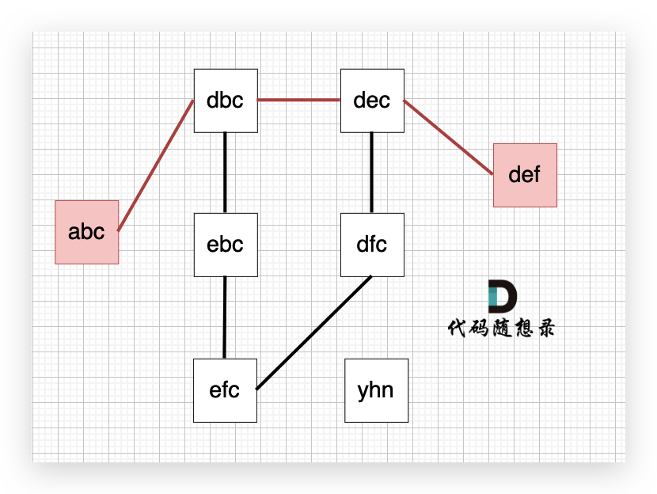

## [110. 字符串接龙](https://kamacoder.com/problempage.php?pid=1183) 
### 解题思路


如图所示，从abc到def不止一条路径，但最短的一条路径上是4个节点。
解决以下两个问题即可：
1. *图中的线是如何连到一起的*：在搜索的过程中，我们可以枚举，用26个字母替换当前字符串的每一个字符，在看替换后 是否在 strList里出现过，就可以判断 两个字符串 是否是链接的。
2. *如何求最短路径长度*：在无权图中，用广搜求最短路最为合适，广搜只要搜到了终点，那么一定是最短的路径。因为广搜就是以起点中心向四周扩散的搜索。

显然本题只需要能够把求解从beginStr到endStr的转换序列，转换为图中求解两个点的最短路径即可，可能的难点在于使用set保存strSet，*确保O（1）的时间里查找是否存在字符串*。

### 代码实现
```C++
#include <iostream>
#include <vector>
#include <string>
#include <unordered_set>
#include <unordered_map>
#include <queue>
using namespace std;

int main() {
    string beginStr, endStr, str;
    int n;
    cin >> n;
    unordered_set<string> strSet;
    cin >> beginStr >> endStr;
    for(int i = 0; i < n; i++) {
        cin >> str;
        strSet.insert(str);
    }

    //记录strSet中的字符串是否被访问过，同时记录访问时路径长度
    unordered_map<string, int> visitMap;

    queue<string> que;
    que.push(beginStr);
    // 初始化
    visitMap.insert(pair<string, int>(beginStr, 1));

    while(!que.empty()) {
        string word = que.front();
        que.pop();
        int path = visitMap[word];

        for(int i = 0; i < word.size(); i++) {
            //尝试替换当前word中每一个字符，查询是否存在strSet
            string newWord = word;
            for(int j = 0; j < 26; j++) {
                newWord[i] = j + 'a';
                if(newWord == word) continue;
                if(newWord == endStr) {
                    cout << path + 1;
                    return 0;
                }
                //如果strSet中存在，并且没有被访问过
                if(strSet.find(newWord) != strSet.end() && visitMap.find(newWord) == visitMap.end()) {
                    que.push(newWord);
                    visitMap.insert(pair<string, int>(newWord, path + 1));
                }
            }
        }
    }
    cout << 0;
}
```