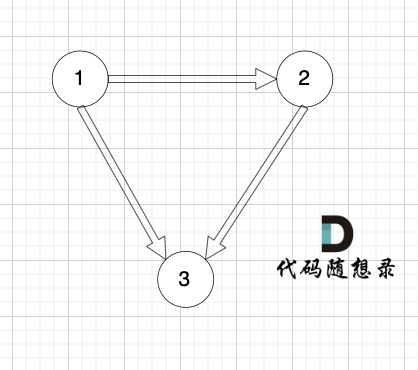
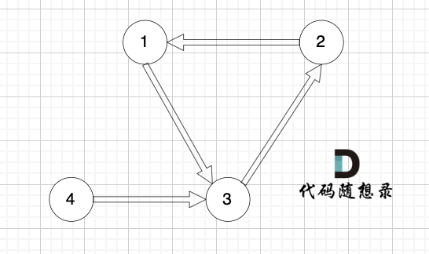
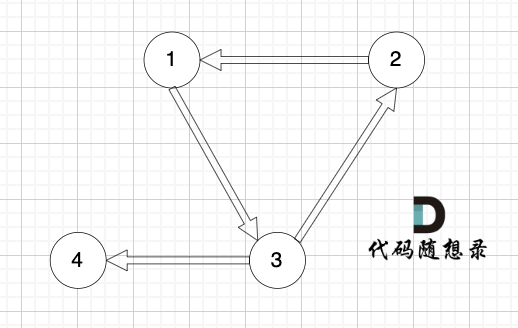

## [109. 冗余的边II](https://kamacoder.com/problempage.php?pid=1182) 
### 解题思路
本题情况复杂，我们来想一下 有向树的性质，如果是有向树的话，只有根节点入度为0，其他节点入度都为1（因为该树除了根节点之外的每一个节点都有且只有一个父节点，而根节点没有父节点）。

1. 如果我们找到入度为2的点，那么删一条指向该节点的边就行了。

2. 入度为2 还有一种情况，情况二，只能删特定的一条边；

节点3 的入度为 2，但在删除边的时候，只能删 这条边（节点1 -> 节点3），如果删这条边（节点4 -> 节点3），那么删后本图也不是有向树了（因为找不到根节点）。
3. 如果没有入度为2的点，说明 图中有环了（注意是有向环）。

对于情况三，删掉构成环的边就可以了。

### 代码实现
```C++
#include <iostream>
#include <vector>
using namespace std;
int n;
vector<int> father (1001, 0);
// 并查集初始化
void init() {
    for (int i = 1; i <= n; ++i) {
        father[i] = i;
    }
}
// 并查集里寻根的过程
int find(int u) {
    return u == father[u] ? u : father[u] = find(father[u]);
}
// 将v->u 这条边加入并查集
void join(int u, int v) {
    u = find(u);
    v = find(v);
    if (u == v) return ;
    father[v] = u;
}
// 判断 u 和 v是否找到同一个根
bool isSame(int u, int v) {
    u = find(u);
    v = find(v);
    return u == v;
}

// 在有向图里找到删除的那条边，使其变成树
void getRemoveEdge(const vector<vector<int>>& edges) {
    init(); // 初始化并查集
    for (int i = 0; i < n; i++) { // 遍历所有的边
        if (isSame(edges[i][0], edges[i][1])) { // 构成有向环了，就是要删除的边
            cout << edges[i][0] << " " << edges[i][1];
            return;
        } else {
            join(edges[i][0], edges[i][1]);
        }
    }
}

// 删一条边之后判断是不是树
bool isTreeAfterRemoveEdge(const vector<vector<int>>& edges, int deleteEdge) {
    init(); // 初始化并查集
    for (int i = 0; i < n; i++) {
        if (i == deleteEdge) continue;
        if (isSame(edges[i][0], edges[i][1])) { // 构成有向环了，一定不是树
            return false;
        }
        join(edges[i][0], edges[i][1]);
    }
    return true;
}

int main() {
    int s, t;
    vector<vector<int>> edges;
    cin >> n;
    vector<int> inDegree(n + 1, 0); // 记录节点入度
    for (int i = 0; i < n; i++) {
        cin >> s >> t;
        inDegree[t]++;
        edges.push_back({s, t});
    }

    vector<int> vec; // 记录入度为2的边（如果有的话就两条边）
    // 找入度为2的节点所对应的边，注意要倒序，因为优先删除最后出现的一条边
    for (int i = n - 1; i >= 0; i--) {
        if (inDegree[edges[i][1]] == 2) {
            vec.push_back(i);
        }
    }
    // 情况一、情况二
    if (vec.size() > 0) {
        // 放在vec里的边已经按照倒叙放的，所以这里就优先删vec[0]这条边
        if (isTreeAfterRemoveEdge(edges, vec[0])) {
            cout << edges[vec[0]][0] << " " << edges[vec[0]][1];
        } else {
            cout << edges[vec[1]][0] << " " << edges[vec[1]][1];
        }
        return 0;
    }

    // 处理情况三
    // 明确没有入度为2的情况，那么一定有有向环，找到构成环的边返回就可以了
    getRemoveEdge(edges);
}
```

这道题目的实现思路还是使用并查集，在输入边的过程中构建并查集，每次插入之前首先判断两个点是否在同一集合中。

关键点在于分别讨论三种情况：
1. 对于存在入度为2的节点，即情况一和二：
调用`isTreeAfterRemoveEdge`函数，如果是该情况，则记录入度为2的节点关联的两条边，其中一条是多余的。根据题意，考虑*优先删除后加入的边*，每次插入并查集之前判断是否是要删除的边，如果是就不插入这条边，然后按照 [11. 冗余的边](11.%20冗余的边.md) 中的思路依次插入边，每次插入前判断是否是同一集合。如果删除该边后仍然是同一集合，说明应该删除另一条边。

2. 情况3，如果存在环，即不存在入度为2的点：
调用`getRemoveEdge`函数，思路与 [11. 冗余的边](11.%20冗余的边.md) 完全相同。
